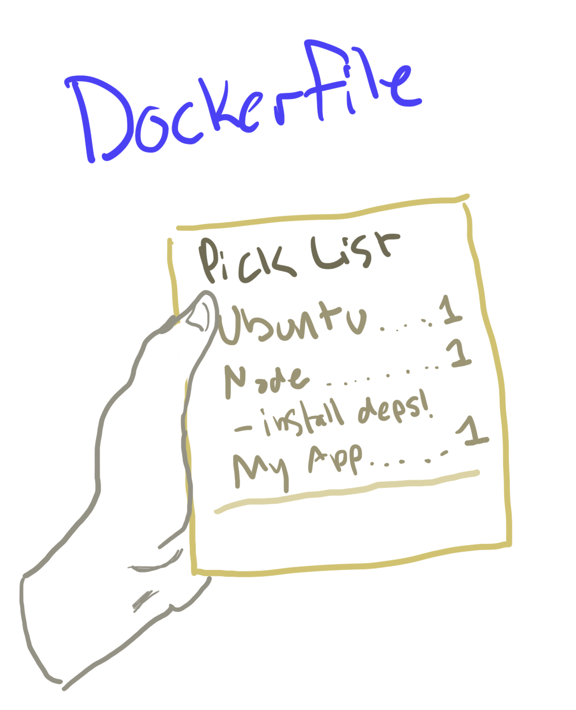
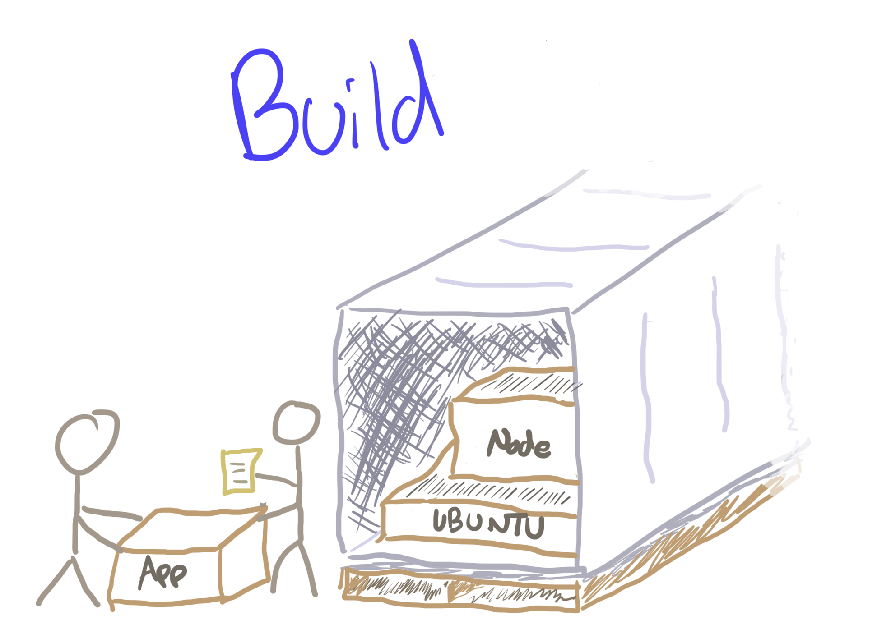
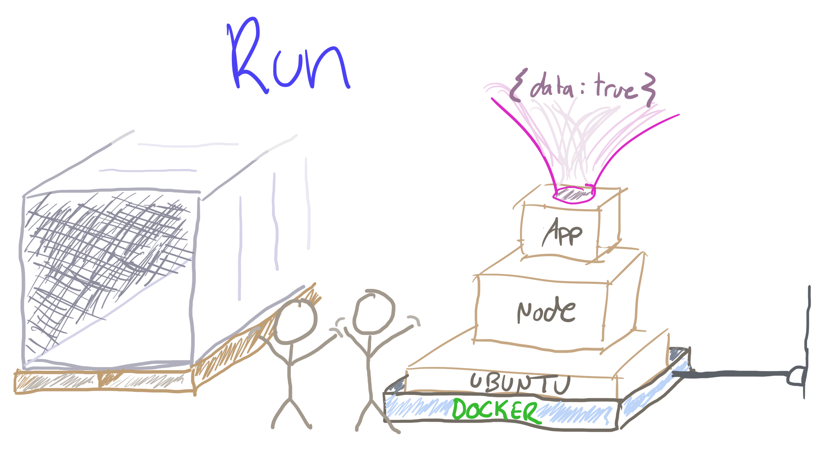

# Building and Deploying a Simple API with Docker

## The Problem

Let's say you're switching everything in your node codebase over to `import`/`export` syntax.

```
// Sooooo yesterday
// const express = require("express")
import express from "express"
```

Everything works locally. You push your repo to Heroku and womp womp- immediate errors. Worse, half of your team has the error too and no one can figure out why.

### Containers to the Rescue

`import`/`export` was added to node in version 12. If you, your teammates, or your server are using slightly different versions, you are about to lose a few hours figuring out what happened and getting everyone on the same version. Luckily, containers can abstract away things like installed software versions so that anything that runs containers will run _your_ container the same.

## What Is Docker?

Docker is a way to bundle up an app with all the things that are needed to make it run, like languages and frameworks. Everyone that can run Docker--you, your coworkers, Heroku, AWS, etc.-- will then run the app in the exact same way.

> _What's up with the "container" thing?_

> _Up until the 1950's, there wasn't a standard way to transport cargo. This was a problem because loading and unloading ships took days and required a custom solution every time, and even then you had to custom load them into trucks to move them inland. Someone who owned a trucking company bought a shipping company, and came up with a standard format for "containers" that could be loaded and unloaded in a standard way on both trucks and ships. Docker works the same way: If you can fill up a standard container, anyone that knows how to work with containers can take your container too without worrying about what the contents are._

Let's start with a Dockerfile, which is a set of instructions on how to setup a computer to run the app. We can think of it like a pick list for a company to load up a shipping container.



With a Dockerfile in hand, we can "build" the file into a a Docker image. This is like packing up a shipping container with all the things specified in pick list.



Anyone who has the Docker image can run it with Docker, and it will work the same way every time. This is like unloading the container and plugging in everything inside of it.



## Follow Along

First, make sure you have [Docker installed](https://www.docker.com/products/docker-desktop).

We want to load the container like this:

```docker
# To build this container, you need...
# A computer with node 12 preinstalled
# Then copy all the files from this folder to `/app` inside the container
# Then, inside the container, `cd` into the `/app` directory
# Then, insider the container, run `npm ci` to install dependencies
# Then, whenenver you run this container, run `npm start`
```

In Dockerese, this looks like this:

```docker
FROM node:12
COPY . /app
WORKDIR /app
RUN npm ci
CMD npm start
```

Add a file called `Dockerfile` (no extension) to the root of the project and copy that into it.

Then, we pack stuff into the container by building it into an image:

```bash
# Hey Docker, can you pack up a container for me
# named "docker-server" based on the picking list in this folder?
sudo docker build -t docker-server .
```

> _Whoa- sudo?_
> Docker requires `sudo` by default because of the control it needs over the file system. If you'd like to not do this, create a `docker` user group and add yourself to it.

If we want to unload the stuff shipping container and plug it in, we can run it with this command:

```
# Hey Docker, run the image called `docker-server`
# in the background, and whatever happens on
# our port 4000 should be sent to its port 80.
sudo docker run -d -p 4000:80 docker-server
```

> Docker starts to get powerful once we define some ways for it to interact with the world outside the container. In this case, we're saying that `http://localhost:4000` on our computer should go to `http://localhost:80` inside the container.

If we go to `http://localhost:4000` in your browser, we should see a JSON response coming back from the server. We don't even need Node installed on your computer for this to work!

This will run the server until you tell it to stop. To stop the server, run `sudo docker kill the-first-few-characters-of-the-container-id`. For example:

```
$ sudo docker run -d -p 4000:80 docker-server
db39a6a0907985652e3e00fad050efc3a228920eb8bb4f2c30506846c7c4cf98

$ sudo docker kill db3
```

The container ID is returned when you run a Docker command with `-d`, and you can also find it with `sudo docker container ls`.

## Deployment

Now that you can run your server locally, let's take advantage of how easy it is to ship our container off to someone else.

### One-time Heroku Setup

* Install the [Heroku CLI](https://devcenter.heroku.com/articles/heroku-cli)
* Login with `heroku login`

### One-time App Setup

* `heroku create app-name-goes-here`
* `heroku stack:set container`

This creates the app, and tells it that we'll be using docker containers instead of any of Heroku's built-in "buildpacks". We still need to tell Heroku how to build and run our app:

```
# Hey Heroku,
# When you build the app in this repo,
# Note that it's a Docker container,
# And the instructions to build it can be found in a file in this folder called `Dockerfile`
# Whenever it's done building, run `npm start`
```

Add a `heroku.yml` file to the root of the folder that says that in Herokuese:

```
build:
  docker:
    web: Dockerfile
run:
  web: npm start
```

### Deployment

Run `git push heroku master`, and in a short while our app will be running publicly on Heroku in an identical environment to the one we ran locally!
